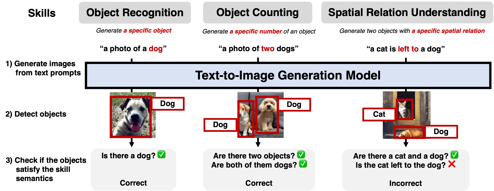
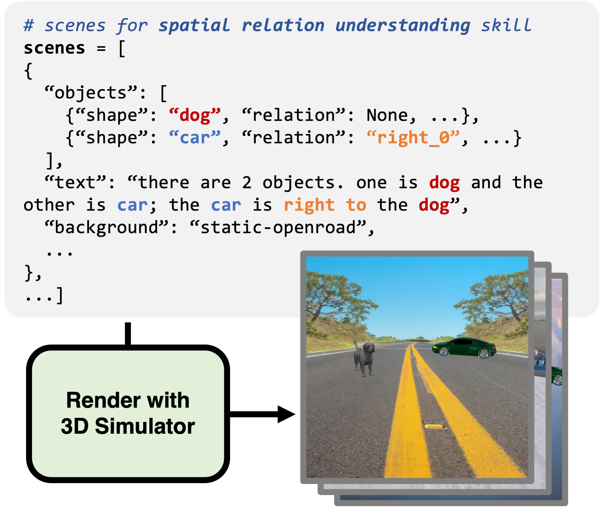

# Visual Reasoning Skill Evaluation on PaintSkills



## Dataset Setup

Download the dataset from https://huggingface.co/datasets/j-min/PaintSkills at `$PAINTSKILLS_DIR` directory.

```bash
git clone https://huggingface.co/datasets/j-min/PaintSkills $PAINTSKILLS_DIR
```


* The `$PAINTSKILLS_DIR` directory has hierarchy as below:
```bash
$PAINTSKILLS_DIR/
    # skill name (i.e., object, count, and spatial)
    {skill}/

        # Scene configuration
        scenes/
            {skill}_train.json
            {skill}_val.json

        # GT Images
        val_images/
            # e.g., 
            # image_object_val_00000.png
            # image_object_val_00001.png
            # ...
        train_images/
            # image_object_train_00000.png
            # image_object_train_00001.png
            # ...

        # Bounding box annotations (for DETR finetuning)
        {skill}_train_bounding_boxes.json
        {skill}_val_bounding_boxes.json

    # metadata for all skills.
    metadata.json
```

## Scene Configuration

The scene configuration files (`scenes/{skill}_{split}.json`) have the following structure, where `skill` is one of `object`, `count`, `spatial`, and `split` is one of `train`, `val`.

e.g., `count_val.json`
```json
{
    "data": [
        {
            "id": "count_val_00000",
            "scene": "HDR-KirbyCove",
            "text": "1 person",
            "skill": "count",
            "split": "val",
            "objects": [
                {
                    "id": 0,
                    "shape": "humanJosh",
                    "coconame": "person",
                    "color": "plain",
                    "relation": null,
                    "scale": 14.114588410729079,
                    "texture": "plain",
                    "rotation": null,
                    "state": "sitting"
                }
            ]
        },
        ...
    ]
}
```

## Evaluation of Text2Img models with DETR

1) Generate the skill-specific images in $image_dir from captions (`text` field in the scene data) with your text-to-image generation models (finetuned on PaintSkills). The evaluation scripts expects that the generated images have filenames in the format of `image_{datum['id']}.png`. For example, if the datum['id'] is `count_val_00000`, the filename should be `image_count_val_00000.png`. 


1) Run the evaluation script

This script automatically downloads [the pretrained DETR checkpoint](https://huggingface.co/j-min/PaintSkills-DETR-R101-DC5) and runs the evaluation.

```bash
skill='object' # switch to other skills (choices=['object', 'count', 'spatial'])
image_dir='/path/to/generated/images'
bash scripts/evaluate_skill_FT_DETR-R101-DC5.sh \
    --skill_name $skill \
    --paintskills_dir $PAINTSKILLS_DIR \
    --image_dir $image_dir \
```

## (Optional) 3D simulator

Please see https://github.com/aszala/PaintSkills-Simulator for our 3D Simulator implementation.



## (Optional) Evaluation on GT images

```bash
skill='object' # count, spatial
bash scripts/evaluate_skill_FT_DETR-R101-DC5.sh \
    --skill_name $skill \
    --gt_data_eval \
    --paintskills_dir $PAINTSKILLS_DIR
```

